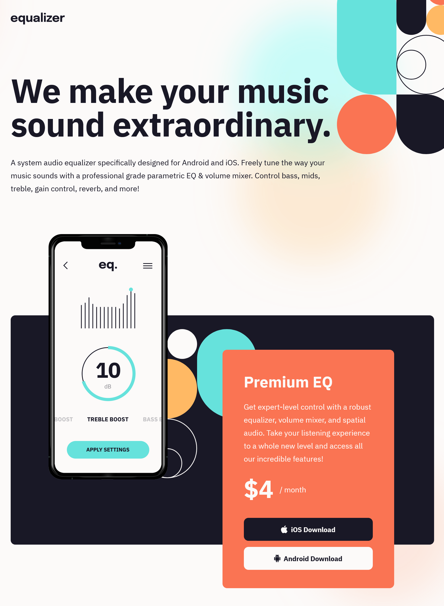

# Frontend Mentor - Equalizer landing page solution

This is a solution to the [Equalizer landing page challenge on Frontend Mentor](https://www.frontendmentor.io/challenges/equalizer-landing-page-7VJ4gp3DE). Frontend Mentor challenges help you improve your coding skills by building realistic projects. 

## Table of contents

- [Overview](#overview)
  - [The challenge](#the-challenge)
  - [Screenshot](#screenshot)
  - [Links](#links)
- [My process](#my-process)
  - [Built with](#built-with)
- [Author](#author)
- [Acknowledgments](#acknowledgments)


## Overview

### The challenge

Users should be able to:

- View the optimal layout depending on their device's screen size
- See hover states for interactive elements

### Screenshot




### Links

- Solution URL: [](https://www.frontendmentor.io/solutions/responsive-landing-page-using-css-grid-and-flexbox-s5rcnMwGeh)
- Live Site URL: [](https://equalizer-landing-page-1yzssb9bs-mattpahuta.vercel.app/)

## My process

### Built with

- Semantic HTML5 markup
- CSS custom properties
- Flexbox
- CSS Grid
- Mobile-first workflow


## Author

- Website - [Matt Pahuta](https://www.mattpahuta.com)
- Frontend Mentor - [@MattPahuta](https://www.frontendmentor.io/profile/MatPahuta)
- Twitter - [@MattPahuta](https://www.twitter.com/MattPahuta)

## Acknowledgments
As always, thanks to the great [Kevin Powell](https://www.twitter.com/KevinJPowell) for a wealth of guidance, tips, and tricks for all things HTML and CSS, including this bit of CSS to easily hide content that's meant for accessibility purposes only. I use this all the time.

```css
.sr-only {
  position: absolute;
  width: 1px;
  height: 1px;
  padding: 0;
  margin: -1px;
  overflow: hidden;
  clip: rect(0, 0, 0, 0);
  white-space: nowrap;
  border: 0;
}
```